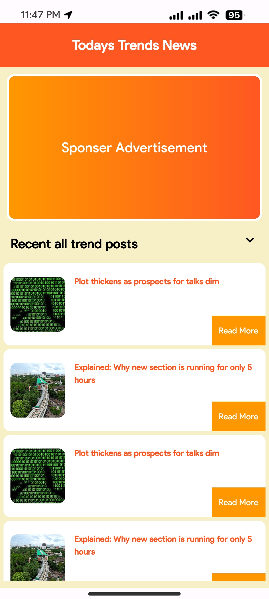
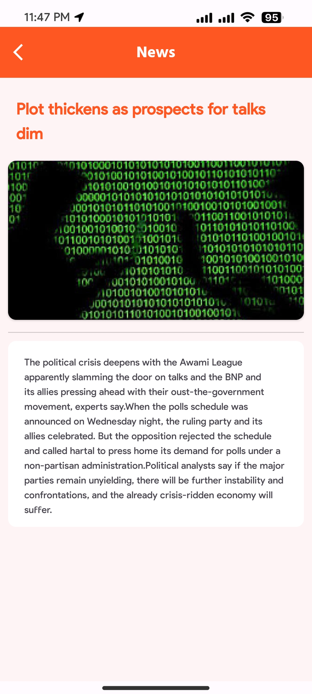

# Simple Android Blog/News App

  
  

## About the App

This is just a simple news or blog app, i loaded all the data from my custom api and all the data will get position with recyclerview

## About the Developer

Hi, I'm Shahriar Sakib, the creator of this app. I currently live in Dhaka.

Connect with me:
- [LinkedIn]([your-linkedin-profile](https://www.linkedin.com/in/shahriarsakib-code/))
- [Facebook]([your-twitter-profile](https://www.facebook.com/shahriarsakib.bro7/))

